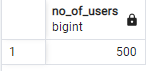
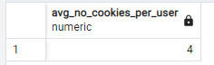
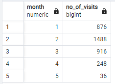
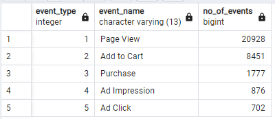
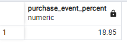
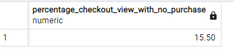
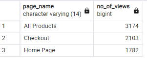
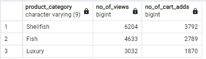
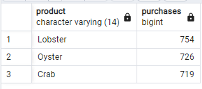

#  Case Study #6 - Clique Bait

## Solution 
### B. Digital Analysis

- How many users are there?
```sql
SELECT COUNT(DISTINCT(user_id)) AS no_of_users
FROM clique_bait.users;
```

- How many cookies does each user have on average?
```sql
WITH cookies AS (
SELECT user_id, COUNT(cookie_id) AS cookie_count
FROM clique_bait.users
GROUP BY user_id
)
SELECT ROUND(AVG(cookie_count),0) AS avg_no_cookies_per_user
FROM cookies;
```

- What is the unique number of visits by all users per month?
```sql
SELECT EXTRACT(month from event_time) AS month, COUNT(DISTINCT(visit_id)) AS no_of_visits
FROM clique_bait.events
GROUP BY EXTRACT(month from event_time)
ORDER BY month;
```

- What is the number of events for each event type?
```sql
SELECT a.event_type, b.event_name, COUNT(a.*) AS no_of_events
FROM clique_bait.events AS a
JOIN clique_bait.event_identifier AS b
USING (event_type)
GROUP BY a.event_type, b.event_name
ORDER BY event_type;
```

- What is the percentage of visits which have a purchase event?
```sql
WITH no_of_events_type AS (
SELECT a.event_type, b.event_name, COUNT(DISTINCT(a.visit_id)) AS no_of_events
FROM clique_bait.events AS a
JOIN clique_bait.event_identifier AS b
USING (event_type)
GROUP BY a.event_type, b.event_name
ORDER BY event_type
)
SELECT ROUND((SUM(no_of_events) FILTER( WHERE event_name = 'Purchase')/SUM(no_of_events)) *100,2) AS purchase_event_percent
FROM no_of_events_type;
```


- What is the percentage of visits which view the checkout page but do not have a purchase event?
```sql
WITH a AS(
SELECT e.visit_id, MAX(CASE WHEN ei.event_name ='Purchase' THEN 1 ELSE 0 END) AS purchase, 
MAX(CASE WHEN ph.page_name = 'Checkout' AND ei.event_name ='Page View' THEN 1 ELSE 0 END) AS checkout
FROM clique_bait.events AS e
JOIN clique_bait.event_identifier AS ei
USING (event_type)
JOIN clique_bait.page_hierarchy AS ph
USING (page_id)
GROUP BY visit_id
)
SELECT ROUND(100-((SUM(purchase)::numeric/SUM(checkout)) *100),2) AS percentage_checkout_view_with_no_purchase
FROM a;
```

- What are the top 3 pages by number of views?
```sql
SELECT b.page_name, COUNT(a.*) AS no_of_views
FROM clique_bait.events AS a
JOIN clique_bait.page_hierarchy AS b
USING (page_id)
JOIN clique_bait.event_identifier AS c
USING (event_type)
WHERE c.event_name = 'Page View'
GROUP BY b.page_name
ORDER BY no_of_views DESC 
LIMIT 3;
```


- What is the number of views and cart adds for each product category?

```sql
SELECT product_category, COUNT(a.event_type) FILTER (WHERE event_name = 'Page View') AS no_of_views, 
COUNT(a.event_type) FILTER (WHERE event_name ='Add to Cart') AS no_of_cart_adds
FROM clique_bait.events AS a
JOIN clique_bait.event_identifier AS b
USING (event_type)
JOIN clique_bait.page_hierarchy AS c
USING (page_id)
WHERE product_category IS NOT NULL
GROUP BY product_category
ORDER BY no_of_views DESC;
```

- What are the top 3 products by purchases?

```sql
WITH purchase_visit_id AS (
SELECT DISTINCT(visit_id)
FROM clique_bait.events
WHERE event_type = 3
),
purchase_info AS (
SELECT a.visit_id, b.page_name, SUM(CASE WHEN a.event_type = 2 THEN 1 ELSE 0 END) AS add_to_cart 
FROM clique_bait.events AS a
JOIN clique_bait.page_hierarchy AS b
USING (page_id)
WHERE b.product_id IS NOT NULL
GROUP BY a.visit_id, b.page_name
),
product_purchase AS (
SELECT  visit_id, 
		page_name, 
		add_to_cart,
		CASE WHEN pv.visit_id IS NOT NULL THEN 1 ELSE 0 END AS purchase
FROM purchase_info AS pi
LEFT JOIN purchase_visit_id AS pv
USING (visit_id)
)
SELECT  page_name AS product, 
		SUM(CASE WHEN add_to_cart = 1 AND purchase = 1 THEN 1 ELSE 0 END) AS purchases
FROM product_purchase
GROUP BY page_name
ORDER BY purchases DESC
LIMIT 3;
```


Next Solution
- [C. Product Funnel Analysis](https://github.com/Mevhare/CliqueBait-Case-Study--8WeekSQLChallenge/blob/main/Solutions/C.%20Product%20Funnel%20Analysis.md)
