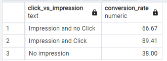

#  Case Study #6 - Clique Bait

## Solution 
### D. Campaign Analysis

Generate a table that has 1 single row for every unique visit_id record and has the following columns:
- user_id
- visit_id
- visit_start_time: the earliest event_time for each visit
- page_views: count of page views for each visit
- cart_adds: count of product cart add events for each visit
- purchase: 1/0 flag if a purchase event exists for each visit
- campaign_name: map the visit to a campaign if the visit_start_time falls between the start_date and end_date
- impression: count of ad impressions for each visit
- click: count of ad clicks for each visit
- (Optional column) cart_products: a comma separated text value with products added to the cart sorted by the order they were added to the cart (hint: use the sequence_number)
- bonus: prepare a single A4 infographic that the team can use for their management reporting sessions, be sure to emphasise the most important points from your findings.

```sql
DROP TABLE IF EXISTS clique_bait.campaign_analysis;

CREATE TABLE clique_bait.campaign_analysis (
  visit_id VARCHAR(6),
  user_id INT,
  visit_start_time TIMESTAMP,
  page_view INT,
  cart_add INT,
  purchase INT,
  campaign_name VARCHAR(33),
  impression INT,
  click INT,
  cart_products TEXT
);
INSERT INTO clique_bait.campaign_analysis (visit_id, user_id, visit_start_time, page_view, cart_add, purchase, campaign_name, impression, click, cart_products)

SELECT	visit_id, 
		user_id,
		visit_start_time,
		COUNT(a.event_type) FILTER(WHERE a.event_type = 1) AS page_view,
		COUNT(a.event_type) FILTER(WHERE a.event_type = 2) AS cart_add,
		SUM(CASE WHEN event_type = 3 THEN 1 ELSE 0 END) AS purchase,
		campaign_name,
		COUNT(a.event_type) FILTER(WHERE a.event_type = 4) AS impression,
		COUNT(a.event_type) FILTER(WHERE a.event_type = 5) AS click,
		STRING_AGG(page_name, ',' ORDER BY sequence_number) FILTER(WHERE a.event_type=2) AS cart_products
		
FROM (	SELECT *, FIRST_VALUE(event_time) OVER(PARTITION BY visit_id ORDER BY visit_id) AS visit_start_time
	  	FROM clique_bait.events) AS a
JOIN clique_bait.users
USING (cookie_id)
LEFT JOIN clique_bait.campaign_identifier AS c
ON a.visit_start_time::date >= c.start_date::date AND a.visit_start_time::date <= c.end_date::date
JOIN clique_bait.page_hierarchy
USING (page_id)
GROUP BY visit_id, user_id, visit_start_time,campaign_name
ORDER BY user_id;
```


Some ideas you might want to investigate further include:

Identifying users who have received impressions during each campaign period and comparing each metric with other users who did not have an impression event
- Does clicking on an impression lead to higher purchase rates?
- What is the uplift in purchase rate when comparing users who click on a campaign impression versus users who do not receive an impression? What if we compare them with users who just an impression but do not click?*/

```sql
SELECT  CASE WHEN impression =1 AND click = 1  THEN 'Impression and Click' 
			 WHEN impression = 0 AND click = 0 THEN 'No impression' 
			 WHEN impression = 1 AND click = 0 THEN 'Impression and no Click' END AS click_vs_impression,
		ROUND(100*(SUM(purchase)/(COUNT(purchase))::numeric),2) AS conversion_rate
FROM clique_bait.campaign_analysis
WHERE visit_start_time::DATE <= '2020-03-31'
GROUP BY  CASE WHEN impression =1 AND click = 1  THEN 'Impression and Click' 
			 WHEN impression = 0 AND click = 0 THEN 'No impression' 
			 WHEN impression = 1 AND click = 0 THEN 'Impression and no Click' END;
```


-- What metrics can you use to quantify the success or failure of each campaign compared to eachother?


```sql
SELECT  campaign_name,
		SUM(impression) AS no_of_impression,
		SUM(click) AS no_of_click,
		ROUND(100*(SUM(click)/(SUM(impression)::numeric)),2) AS click_through_rate,
		SUM(purchase) AS no_of_purchase,
		ROUND(100*(SUM(purchase) FILTER(WHERE impression =1 AND click = 1)/(COUNT(purchase) FILTER(WHERE impression =1 AND click =1))::numeric),2) AS conversion_rate
FROM clique_bait.campaign_analysis
WHERE visit_start_time::DATE <= '2020-03-31' AND campaign_name IS NOT NULL
GROUP BY campaign_name;
```


